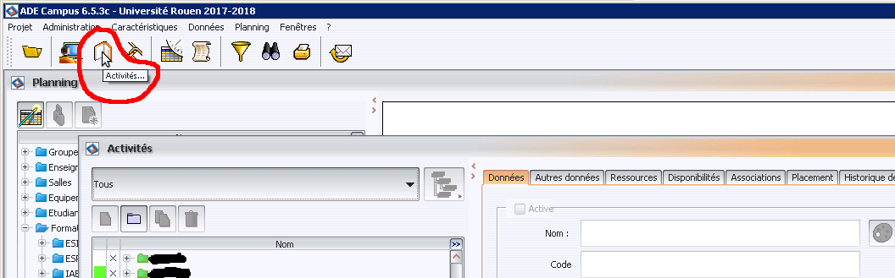
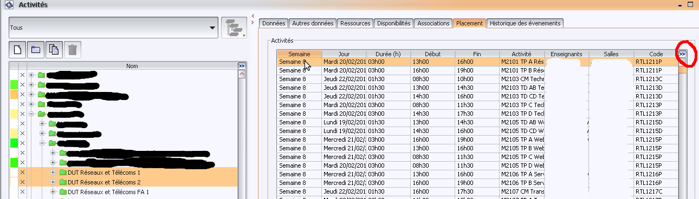
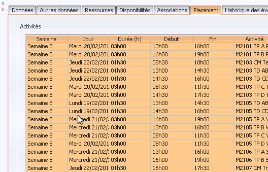

## ADEPoPro: Manuel français

Voir https://github.com/skramm/adepopro

(version du 2018-06-11)

Le fichier d'entrée au format csv est à générer depuis le client lourd Windows de ADE Campus.
La manip ci-dessous a été testée avec la version 6.5.3

1. Ouvrir ADE Campus et sélectionner "Activités" dans la barre d'outils:

1. Dans le volet de gauche, sélectionner les formations désirées, puis cliquer sur la première ligne de la liste.<br>
Vérifier que les champs apparaissent bien dans cet ordre.
Au besoin, ajouter les champs nécessaires en cliquant sur le bouton entouré en rouge ci-dessous.

1. Sélectionner l'ensemble des évènements avec CTRL-A:

1. Copier (CTRL-C), puis ouvrir un tableur (Excel ou LibreOffice-Calc), sélectionner la cellule en heut à gauche, et coller (CTRL-V).
1. Sauvegarder au format CSV, en vérifiant les options: séparateur de champ: ";", et pas de guillements autour des chaînes de caractères.

Vous avez maintenant un fichier CSV, qui pourra être utilisée comme entrée de AdePoPro, comme ceci:
```
adepopro monfichier.csv
```

En cas de succès, ceci va générer 4 fichiers dans le dossier courant:
* 2 fichier csv de 9 champs, qui peuvent être ouverts dans n'importe quel tableur, permettant un reporting ou d'autres traitements:
 * ```adepopro_E_monfichier.csv``` :<br>
 Contient la liste des enseignants avec pour chacun d'eux, le nombre de jours et de semaines d'activité, le volume total d'enseignement en CM,TD, TP, ainsi que le total présentiel (4 valeurs), et le nombre de module où l'enseignant intervient.
 * ```adepopro_M_monfichier.csv```<br>
 Contient la liste des modules avec pour chacun d'eux, le nombre de jours et de semaines d'activité, le volume CM,TD, TP, ainsi que le total, et le nombre d'enseignants intervenant sur ce module.


* 2 fichiers "texte"
 * ```adepopro_EM_monfichier.txt```
 * ```adepopro_ME_monfichier.txt```

Ces fichiers donnent le détail des infos.
* Le fichier "EM" (*Enseignant/Module*) donne pour chaque enseignant le détails des modules dans lequel il intervient, avec le volume correspondant.
* Le fichier "ME" (*Module/Enseignant*) donne pour chaque module la liste des enseignants qui interviennent, avec le volume correspondant.

Les volumes sont données sous la forme:<br>
```vol_CM;vol_TD;vol_TP;total```

S. Kramm - 2018
